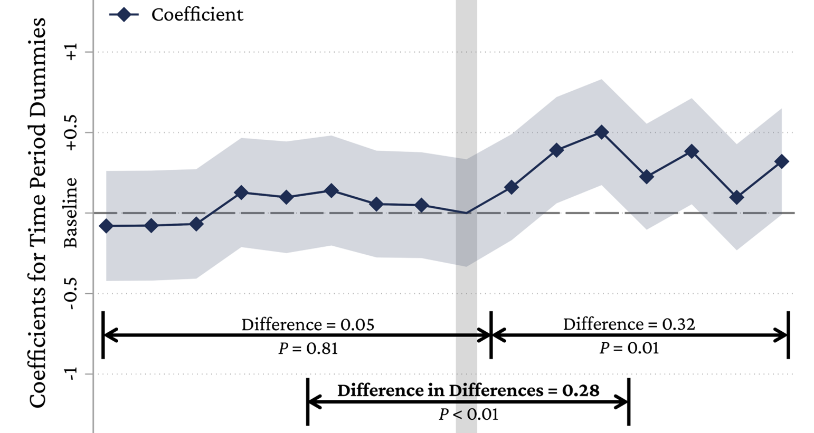

---

##### Download

+ [Paper](sunflower.pdf)

---

##### Abstract

Firms with political connections to a regime with an authoritarian history face a dilemma when the regime undergoes a democratic transition. Such connections provide an essential competitive advantage when the regime is in power but become a liability when an institutional transition brings democratic change. This study theorizes that when mass protests expose a regime’s distorted policies favoring elites over others and signal a high probability of regime turnover, firms may hedge against the risks associated with their political connections by engaging in philanthropy. We further contend that this effect is stronger for firms located in regions characterized by the rise of an opposing political party or a strong civil society. We find support for our theory in Taiwan’s 2014 Sunflower Movement. Our article reveals a strategy that firms adopt to survive democratic transitions and thus contributes to research on how firms use non-market strategies to adapt to institutional changes. Our research also shows that strategic corporate social responsibility (CSR) can substitute for corporate political activity or compensate for its limitations, and it expands research on the signaling function of social movements from public to private politics.

---

---

##### Citation

**Cai, Y., Yue, L. Q., Lin, F., Yan, S., & Yang, H. (2025)**. CSR as Hedging Against Institutional Transition Risk: Corporate Philanthropy After the Sunflower Movement in Taiwan. ***Administrative Science Quarterly***, *70*(2), 367-402.
